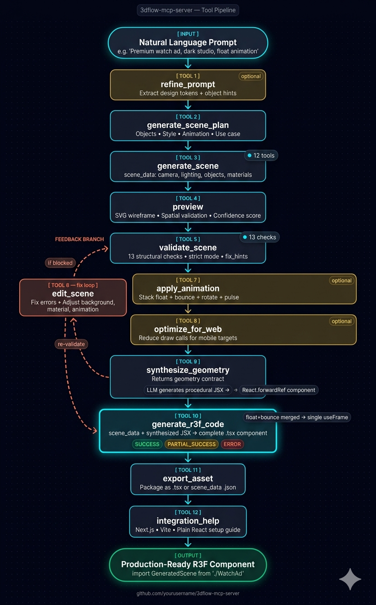

# web3d-mcp-server

  
  

MCP server for 3D scene generation for web and ads, built on React Three Fiber (R3F).

`web3d-mcp-server` turns a plain-English prompt into a structured scene plan, validated `scene_data`, geometry synthesis contracts, framework-ready `.jsx` or `.tsx` React Three Fiber code, exportable assets, and integration guidance.

---

## Hosted Server

The fastest way to get started — no installation required.

**MCP endpoint:**

```
https://web3d-mcp.onrender.com/mcp
```

Jump to [Using the Hosted Server](#using-the-hosted-server) for setup instructions.

---

## Quick Navigation

| Start Here | Reference | Extra Docs |
| --- | --- | --- |
| [Using the Hosted Server](#using-the-hosted-server) | [Recommended Pipeline](#recommended-pipeline) | [Quick Example](./quick_example.md) |
| [What It Does](#what-it-does) | [Tools](#tools) | [Tool Information](./tool_information.md) |
| [Who It Helps](#who-it-helps) | [Local Installation](#local-installation) | [Folder Structure](./folder_structure.md) |
| [Technologies](#technologies) | [Operational Notes](#operational-notes) | [Sample Prompts](./sample_prompt.md) |
| [Architecture](#architecture) | [Examples](#examples) | [License](#license) |

## What It Does

- Converts natural-language scene requests into a structured 3D workflow.
- Produces `scene_data` with camera, lighting, objects, materials, background, animations, and design tokens.
- Supports preview, validation, targeted editing, animation stacking, optimization, geometry synthesis, code generation, export, and integration help.
- Generates React Three Fiber scene components for plain React, Vite, and Next.js.
- Helps AI assistants follow a predictable, tool-based pipeline instead of generating raw 3D code from scratch.

## Who It Helps

- Frontend engineers building hero sections, landing pages, and product showcases.
- Design engineers prototyping interactive web visuals and ad concepts.
- AI application builders who want an MCP-based 3D scene workflow.
- Agencies and product teams that need faster concept-to-code iteration for 3D scenes.

## Technologies

### Core Stack

| Area | Technologies |
| --- | --- |
| Language | TypeScript |
| MCP runtime | FastMCP |
| Validation | Zod |
| Runtime | Node.js |
| Environment config | dotenv |
| Testing | Jest |
| Development workflow | nodemon, TypeScript compiler |

### Output Ecosystem

The server generates assets and guidance for:

- React Three Fiber
- Three.js
- `@react-three/drei`
- Next.js
- Vite
- plain React

## Architecture

This server is hybrid and supports two runtime modes.

### Local Mode: `stdio`

- Best for Claude Desktop, Cursor, and other local MCP clients.
- Runs as a child process on the developer machine.
- Ideal for local development and personal workflows.

### Remote Mode: HTTP Stream

- Best for shared teams, browser clients, and hosted setups.
- Exposes the MCP endpoint at `/mcp`.
- The public hosted endpoint is `https://web3d-mcp.onrender.com/mcp`.

## Recommended Pipeline

<p align="center">
  
</p>


Notes:

- `edit_scene` can be used any time after `generate_scene` and before `generate_r3f_code`.
- `optimize_for_web` is optional but useful for mobile or performance-sensitive targets.
- `generate_r3f_code` can return `SYNTHESIS_REQUIRED`, `SUCCESS`, `PARTIAL_SUCCESS`, or `ERROR`.
- `PARTIAL_SUCCESS` means one or more objects fell back to a red wireframe placeholder.

## Tools

The server currently registers 12 tools.

| # | Tool | Primary role |
| --- | --- | --- |
| 1 | `refine_prompt` | Structure free-form creative intent |
| 2 | `generate_scene_plan` | Convert prompt into a scene plan |
| 3 | `generate_scene` | Build full `scene_data` |
| 4 | `preview` | Visualize layout and spatial quality |
| 5 | `validate_scene` | Run structural validation |
| 6 | `edit_scene` | Make targeted scene revisions |
| 7 | `apply_animation` | Add or merge animations |
| 8 | `optimize_for_web` | Reduce performance cost |
| 9 | `synthesize_geometry` | Create geometry contracts |
| 10 | `generate_r3f_code` | Produce final React Three Fiber code |
| 11 | `export_asset` | Package outputs as files |
| 12 | `integration_help` | Explain app integration steps |

Detailed tool reference: [tool_information.md](./tool_information.md)

## Examples

Worked example: [quick_example.md](./quick_example.md)

Prompt examples for users: [sample_prompt.md](./sample_prompt.md)

## Folder Structure

Repository structure reference: [folder_structure.md](./folder_structure.md)

---

## Using the Hosted Server

The server is publicly hosted and ready to use — no installation or local setup required. All 12 tools are available.

**Hosted MCP URL:**

```
https://web3d-mcp.onrender.com/mcp
```

### Connect via Claude Desktop

**Step 1 — Open the Claude Desktop config file.**

On macOS:
```
~/Library/Application Support/Claude/claude_desktop_config.json
```

On Windows:
```
%APPDATA%\Claude\claude_desktop_config.json
```

If the file does not exist, create it.

**Step 2 — Add the remote server entry.**

```json
{
  "mcpServers": {
    "web3d": {
      "url": "https://web3d-mcp.onrender.com/mcp"
    }
  }
}
```

If you already have other MCP servers configured, add the `web3d` entry alongside them inside the `mcpServers` object.

**Step 3 — Restart Claude Desktop.**

Fully quit and relaunch the app. Claude Desktop connects to the remote server at startup.

**Step 4 — Verify the connection.**

Open a new conversation and try a prompt like:

```
Generate a 3D scene of a glowing orb floating above a reflective surface.
```

If Claude begins using tools like `generate_scene_plan` or `generate_scene`, the connection is working.

### Connect via Cursor or Other MCP Clients

Any MCP client that supports remote HTTP stream transport can connect using the same URL:

```json
{
  "mcpServers": {
    "web3d": {
      "url": "https://web3d-mcp.onrender.com/mcp"
    }
  }
}
```

Refer to your client's documentation for the exact config file location and format.

### Notes

- The server is hosted on Render and may take 30–60 seconds to respond on the first request after a period of inactivity. Subsequent requests in the same session will be fast.
- No authentication is required.

---

## Local Installation

> Only needed if you want to run the server locally for development or self-hosting.
> For most use cases, the [hosted server](#using-the-hosted-server) is the simpler option.

### Prerequisites

- Node.js 18+
- npm

### Commands

Install dependencies:

```bash
npm install
```

Build the server:

```bash
npm run build
```

Start the local `stdio` server:

```bash
npm run start
```

Run development mode with file watching:

```bash
npm run dev
```

Run development mode over HTTP stream:

```bash
npm run dev:http
```

Run the project health checks:

```bash
npm run health
```

### Claude Desktop — Local Config

Point Claude Desktop at the built `dist/server.js` file.

`~/Library/Application Support/Claude/claude_desktop_config.json`

```json
{
  "mcpServers": {
    "web3d": {
      "command": "node",
      "args": [
        "/Users/alex/dev/web3d-mcp-server/dist/server.js"
      ]
    }
  }
}
```

### Cursor and Other `stdio` Clients

Use the same `command` and `args` pattern:

```json
{
  "mcpServers": {
    "web3d": {
      "command": "node",
      "args": [
        "/Users/alex/dev/web3d-mcp-server/dist/server.js"
      ]
    }
  }
}
```

---

## Framework Support

| Framework | `framework` param | Notes |
| --- | --- | --- |
| Plain React | `"plain"` | No directive added |
| Vite | `"vite"` | No directive added |
| Next.js App Router | `"nextjs"` | Adds `"use client"` |
| Next.js Pages Router | `"nextjs"` | Pair with `integration_help` and `dynamic(..., { ssr: false })` |

## TypeScript Support

| `typing` param | Output |
| --- | --- |
| `"none"` | Plain `.jsx` |
| `"typescript"` | `.tsx` with `Group \| Mesh` ref types |
| `"prop-types"` | `.jsx` with a PropTypes block |

## Operational Notes

### Geometry Cache

- Synthesized JSX can be cached locally under `.synthesis_cache/geometry_cache.json`.
- The cache is created on demand.
- Repeated object and style combinations can reuse earlier geometry.

### Status Values

| Status | Meaning |
| --- | --- |
| `SUCCESS` | Scene code generated with no placeholder fallbacks |
| `PARTIAL_SUCCESS` | Scene code generated, but one or more objects fell back to placeholders |
| `SYNTHESIS_REQUIRED` | More geometry synthesis work is required before final code generation |
| `ERROR` | Generation failed and did not produce a usable component |

## Author

Dev Agrawal

## License

See [LICENSE](./LICENSE).